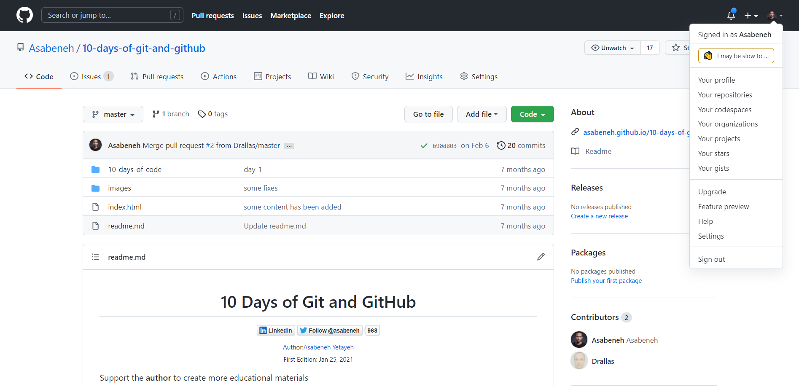

# GitHub darslari

# 1-kun

## Asosiy buyruq qatorlari

Dasturchilar Unix -ning asosiy buyruqlarini bilishlari kerak. Git bash, mac terminal yoki windows buyruq satri (_cmd_) yordamida ba'zi kerakli vazifalarni bajarish kerak. Ushbu qo'llanmada biz dasturchi sifatida sizga kerak bo'lishi mumkin bo'lgan Unix buyruq asoslarini o'rganish uchun _git bash_-dan foydalanamiz. Bu to'liq ro'yxat emas, lekin kundalik foydalanish uchun  yetarli. Git bash -dan foydalanish uchun avval [git](https://git-scm.com/)-ni o'rnatish kerak.

### Joriy ishchi papkasi
_pwd_ buyrug'i yordamida ishchi katalogni tekshirish.

```sh
[ilosrim@developer ~]$ pwd
/home/ilosrim
```

### Papkalar bo'ylab ko'chish

Keling _cd_ (change directory) yordamida ish stoliga o'tamiz.

```sh
[ilosrim@developer ~]$ cd Desktop/
[ilosrim@developer Desktop]$
```

Qayerda ekanligingizni tekshirish uchun _pwd_ buyruq satridan foydalaning

```sh
[ilosrim@developer Desktop]$ pwd
/home/ilosrim/Desktop
```

Biz papkalarga kirish va chiqish uchun _cd_ komandasidan foydalanamiz.

### Papka yaratish

Keling, ish stoli ichida papka yarataylik. Unga _10-days-of-code_ nomini beramiz. Siz unga har qanday nom berishingiz mumkin. Papka yaratish uchun _mkdir_ buyrug'idan foydalanamiz.

```sh
[ilosrim@developer Desktop]$ mkdir 10-days-of-code
```

Endi _cd_ buyrug'i yordamida _10-days-of-code_ papkasiga o'tamiz.

```sh
[ilosrim@developer Desktop]$ cd 10-days-of-code/
[ilosrim@developer 10-days-of-code]$ pwd
/home/ilosrim/Desktop/10-days-of-code
```

### Fayllar va papkalarni ro'yxatga olish

Biz _ls_ buyrug'i yordamida bizda mavjud bo'lgan fayllar va papkalarni tekshirishimiz mumkin.

```sh
[ilosrim@developer 10-days-of-code]$ ls
```

_10-days-of-code_ papkasida hech qanday fayl yoki papka topilmadi, chunki biz ularni hali yaratmaganmiz. Keling, bir nechta papka yarataylik

```sh
[ilosrim@developer 10-days-of-code]$ mkdir day-01
```

Keling, papkada fayllar yoki papkalar mavjudligini tekshirib ko'ramiz.
```sh
[ilosrim@developer 10-days-of-code]$ ls
day-01
day-1
```
Bu yerda siz yaratgan day-01 papkasini ko'rasiz.

Keling, bir vaqtning o'zida bir nechta papkalarni yarataylik va _ls_-dan foydalanib, _10-days-of-code_-dagi barcha papkalarni ko'rib chiqaylik.

Bir vaqtning o'zida bir nechta papkalarni yaratish

```sh
[ilosrim@developer 10-days-of-code]$ mkdir day-{1..10}
```

_ls_ buyrug'i yordamida yaratgan papkalar ro'yxatini ko'rib chiqamiz.

```sh
[ilosrim@developer 10-days-of-code]$ ls
day-01  day-1  day-10  day-2  day-3  day-4  day-5  day-6  day-7  day-8  day-9
```

### Batafsil ro'yxat

Keling, _ls -la_ buyrug'i yordamida papkalarning batafsil ro'yxatini ko'rib chiqaylik.

```sh
[ilosrim@developer 10-days-of-code]$ ls -la
total 0
drwxr-xr-x 1 ilosrim ilosrim 114 Sep 23 09:54 .
drwxr-xr-x 1 ilosrim ilosrim  30 Sep 23 09:46 ..
drwxr-xr-x 1 ilosrim ilosrim   0 Sep 23 09:50 day-01
drwxr-xr-x 1 ilosrim ilosrim   0 Sep 23 09:54 day-1
drwxr-xr-x 1 ilosrim ilosrim   0 Sep 23 09:54 day-10
drwxr-xr-x 1 ilosrim ilosrim   0 Sep 23 09:54 day-2
drwxr-xr-x 1 ilosrim ilosrim   0 Sep 23 09:54 day-3
drwxr-xr-x 1 ilosrim ilosrim   0 Sep 23 09:54 day-4
drwxr-xr-x 1 ilosrim ilosrim   0 Sep 23 09:54 day-5
drwxr-xr-x 1 ilosrim ilosrim   0 Sep 23 09:54 day-6
drwxr-xr-x 1 ilosrim ilosrim   0 Sep 23 09:54 day-7
drwxr-xr-x 1 ilosrim ilosrim   0 Sep 23 09:54 day-8
drwxr-xr-x 1 ilosrim ilosrim   0 Sep 23 09:54 day-9
```

Yuqoridagi buyruq yordamida biz papka yoki faylning batafsil ko'rinishini ko'rishimiz mumkin.

### Fayl yaratish

Endi faylni qanday yaratishni ko'rib chiqaylik. Fayl yozish uchun _touch_ buyrug'idan foydalanishimiz mumkin.

```sh
[ilosrim@developer 10-days-of-code]$ touch day-01.txt
[ilosrim@developer 10-days-of-code]$ ls
day-01  day-01.txt  day-1  day-10  day-2  day-3  day-4  day-5  day-6  day-7  day-8  day-9
```

Ko'rib turganingizdek, ro'yxatda _day-01.txt_ bor. Bu shuni anglatadiki, biz _10-days-of-code_ papkasida _day-01.txt_ faylini yaratdik. Siz shuningdek _ls -la_ buyrug'i bilan papkalar va fayllarning batafsil ro'yxatini ko'rishingiz mumkin.

### Faylni ochish va yozish

Keling, _day-01.txt_ faylini ochamiz va unga matn qo'shamiz. Ochish va yozish uchun biz _nano_ buyrug'idan foydalanamiz.

```sh
[ilosrim@developer 10-days-of-code]$ nano day-01.txt
```


Yuqoridagi rasmdan ko'rinib turibdiki, kursor faol va siz maydonga yozishingiz mumkin. Kursorni chapga, o'ngga, yuqoriga va pastga siljitish uchun faqat tugmalaridan foydalanishingiz mumkin. Keling, ochilgan maydonga matn yozamiz. Pastda ko'rsatmalar bor, ular qanday chiqish kerakligini aytadi. Masalan, _ctrl + x_ - chiqish. Chiqish paytida siz saqlaysiz yoki bekor qilasiz.


Endi siz o'zgartirilgan faylni _Y (Yes)_ yozib saqlashingiz mumkin yoki uni _ctrl + c_ tugmalarini bosish orqali bekor qilishingiz mumkin.

_Y_ yozgandan so'ng, _Enter_ ni bosing.

### Faylni o'qish uchun ochish

_cat_ buyrug'idan faqat faylni o'qish uchun foydalanishimiz mumkin.

```sh
[ilosrim@developer day-1]$ cat day-01.txt
birinchi nano text
```

### Faylni nusxalash

_cp_ buyrug'i yordamida nusxa ko'chirish orqali _day-01.txt_-dan _day-01-backup.txt_-ni olaylik.

```sh
[ilosrim@developer day-1]$ cp day-01.txt day-01-backup.txt
[ilosrim@developer day-1]$ ls
day-01-backup.txt  day-01.txt
```

### Fayl nomini o'zgartirish

_mv_ buyrug'i fayl nomini o'zgartirish uchun ham, boshqa katalogga ko'chirish uchun ham ishlatiladi.

Keling, _10-days-of-code_ papkasida ko'proq fayllar bo'lsin. Fayllarni yaratish uchun _touch_ buyrug'idan foydalanishimiz mumkin.

```sh
[ilosrim@developer day-1]$ touch day-{1..5}.txt
[ilosrim@developer day-1]$ ls
day-01-backup.txt  day-01.txt  day-1.txt  day-2.txt  day-3.txt  day-4.txt  day-5.txt
```

Keling, _mv_ buyrug'i yordamida _day-2.txt_-ni _second-day.txt_ deb o'zgartiramiz.

```sh
[ilosrim@developer day-1]$ ls
day-01-backup.txt  day-01.txt  day-1.txt  day-3.txt  day-4.txt  day-5.txt  second-day.txt
```

### Fayl va papkalarni ko'chirish

Fayllarni katalogga joylashtirish uchun _mv_ va _cp_ buyruqlaridan foydalanish mumkin. _cp_ fayl yoki papkaning nusxasini boshqa papkaga ko'chiradi, lekin _mv_ uni faqat nusxa ko'chirmasdan ko'chiradi.
_day-1.txt_-ni _new_ papkasiga ko'chiramiz.
```sh
[ilosrim@developer day-1]$ mkdir new
[ilosrim@developer day-1]$ mv day-1.txt new
[ilosrim@developer day-1]$ ls
day-01-backup.txt  day-01.txt  day-3.txt  day-4.txt  day-5.txt  new  second-day.txt
[ilosrim@developer day-1]$ cd new
[ilosrim@developer new]$ ls
day-1.txt
```

Let's try to move a file using the _cp_ command. Let's move the day-1-backup.txt to day-1 folder
_cp_ buyrug'i yordamida faylni ko'chirishga harakat qilaylik. _day-01-backup.txt_ faylini _new_ papkasiga o'tkazamiz.

```sh
[ilosrim@developer day-1]$ cp day-01-backup.txt new
[ilosrim@developer day-1]$ ls
day-01-backup.txt  day-01.txt  day-3.txt  day-4.txt  day-5.txt  new  second-day.txt
[ilosrim@developer day-1]$ cd new
[ilosrim@developer new]$ ls
day-01-backup.txt  day-1.txt
```

_day-1-backup.txt_ nusxa ko'chirilgan versiyasi _new_ jildiga ko'chirildi.
Keling, avval bir nechta zaxira fayllarini yaratamiz va ularni zaxira papkasiga o'tkazamiz

```sh
[ilosrim@developer day-1]$ mkdir backups
[ilosrim@developer day-1]$ cd backups/
[ilosrim@developer backups]$ touch day-{2..3}-backup.txt
[ilosrim@developer backups]$ ls
day-2-backup.txt  day-3-backup.txt
```

Bir nechta fayllarni ko'chirish

```sh
[ilosrim@developer day-1]$ mv -t backups/ day-01-backup.txt day-01.txt 
[ilosrim@developer day-1]$ cd backups/
[ilosrim@developer backups]$ ls
day-01-backup.txt  day-01.txt  day-2-backup.txt  day-3-backup.txt
```

### Fayl va papkalarni o'chirish

Faylni _rm_ buyrug'i yordamida o'chirib tashlaylik. _day-1-backup.txt_ faylini _new_ papkasidan olib tashlaylik.

```sh
[ilosrim@developer day-1]$ cd new
[ilosrim@developer new]$ ls
day-01-backup.txt  day-1.txt
[ilosrim@developer new]$ rm day-01-backup.txt 
[ilosrim@developer new]$ ls
day-1.txt
```

_rmdir_ buyrug'i yordamida _day-ten_ papkasini o'chirib tashlaylik. _rmdir_ jildni o'chirib tashlaydi.

```sh
[ilosrim@developer day-1]$ mkdir day-ten
[ilosrim@developer day-1]$ ls
backups  day-3.txt  day-4.txt  day-5.txt  day-ten  new  second-day.txt
[ilosrim@developer day-1]$ rmdir day-ten
[ilosrim@developer day-1]$ ls
backups  day-3.txt  day-4.txt  day-5.txt  new  second-day.txt
```

Endi, zaxira papkasini _cp_ buyrug'i yordamida backups-2 va backups-3 ga ko'chirib olaylik. Keyin biz zaxira nusxalarini o'chirib tashlaymiz. _-r_ bilan _cp_ uni rekursiv tarzda nusxalash uchun ishlatilgan.

```sh
[ilosrim@developer day-1]$ cp -r backups backups-2
[ilosrim@developer day-1]$ ls
backups  backups-2  day-3.txt  day-4.txt  day-5.txt  day-ten  new  second-day.txt
```

Endi backups-3 yaratish uchun yuqoridagi qadamni bajaraylik

```sh
[ilosrim@developer day-1]$ cp -r backups backups-3
[ilosrim@developer day-1]$ ls
backups  backups-2  backups-3  day-3.txt  day-4.txt  day-5.txt  day-ten  new  second-day.txt
```

Endi backups-3-da fayllar bor va na _rm_, na _rmdir_ uni o'chirmaydi. Shuning uchun biz uni o'chirish uchun bir nechta buyruqlardan foydalanishimiz mumkin. Buni quyidagi buyruq bilan sinab ko'raylik.

```sh
[ilosrim@developer day-1]$ rm -rf backups-3
[ilosrim@developer day-1]$ ls
backups  backups-2  day-3.txt  day-4.txt  day-5.txt  day-ten  new  second-day.txt
```

_Tabriklaymiz! Endi siz asosiy buyruq qatorlarini bilardingiz!_

# 2-kun

## Git va GitHub

_Git_ - bu versiya boshqaruv dasturi. Qanday bo'lmasin, _git_ va _GitHub_ -dan birgalikda foydalanish kerak bo'ladi.

Loyihalaringizni bulutda saqlash yoki jamoangiz bilan hamkorlik qilish uchun _git_ va _GitHub_ -dan foydalanishingiz kerak. Bu shuni anglatadiki, bu ishlab chiquvchilar yoki yozuvchilarga har xil joylarda joylashgan bo'lsa ham bitta loyihada ishlashga imkon beradi.

Versiyalarni boshqarish - vaqt o'tishi bilan fayl yoki fayllar to'plamidagi o'zgarishlarni yozib olish vositasi bo'lib, keyinchalik ma'lum versiyalarni eslab qolishingiz mumkin.

Agar siz darslikni ko'rishni xohlasangiz, bu [havolani](https://youtu.be/-H9OtQJyVbY) bosing

### 1. Gitni o'rnatish

Birinchidan, siz Git versiyasini boshqarish dasturini o'rnatishingiz kerak.

- Git:
  O'rnatsih [git](https://git-scm.com/downloads)

### 2. Ma'lumotlar omborining holatini tekshirish

_git status_ buyrug'i loyihaning holatini bilish imkonini beradi:
Agar shunday bo'lsa

- initiated
- modified
- staged

Biz _git status_ buyrug'ini xohlagan vaqtda yozishimiz mumkin. Bu sizning loyihangizda nima bo'layotganini tekshirish vositasi.

### 3. Ismingizni va elektron pochtangizni sozlang

Agar qurilmangiz Windows bo'lsa, Git bash -ni oching yoki agar qurilmangiz MacOS yoki Linux bo'lsa, Mac terminal yoki Linux terminalni oching va keyin quyidagi buyruqlarni yozing.

```shell
git config --global user.name 'yourname'
git config --global user.email 'youremail'
```
_yourname_ o'rniga o'zingizning github username-ingizni, _youremail_ o'riniga email-ingizni kiriting 

### 4. Lokal git omborini yarating

Ushbu bosqichda siz loyihangiz uchun papka (katalog) yaratasiz. Loyiha - bu ma'lum bir loyihaga tegishli barcha fayllarni saqlaydigan oddiy papka. Mahalliy ombor - bu sizning kompyuteringizda joylashgan loyiha yoki papka.

Terminalga yozing:

```shell
mkdir project_name
cd project_name
```

Aytgancha, siz Windows yoki Mac -ning GUI (foydalanuvchi grafik interfeysi) yordamida odatdagi tarzda papkalarni yaratishingiz mumkin.

### 5. Git -ni ishga tushiring

Yangi mahalliy omborni yoki mavjud mahalliy omborni yaratgandan so'ng, omborni quyidagi buyruq bilan ishga tushiring:

```shell
   git init
```

Git loyiha fayllari va papkalaridagi o'zgarishlarni kuzatadi.

### 6. Tayyorlash maydoniga fayl qo'shing

Fayl sahnalash maydoniga bir necha usul bilan qo'shilishi mumkin.
Bitta faylni qo'shish uchun biz _git add_ buyrug'idan so'ng fayl nomini ishlatamiz

```shell
   git add filename
```

Qo'shmoqchi bo'lgan fayllar ko'p bo'lsa _git add_ dan so'ng nuqta yoki _-A_ yoazsangiz barcha fayllar belgilanadi

```shell
   git add .
```

Bir vaqtning o'zida qo'shish va majburiy bo'lgan qisim bu - _git commit_

```sh
  git commit -am 'commit message'
```

### 7. Faylni bosqichdan chiqarish

```shell
    git reset HEAD filename
```

### 8. O'zgarishlarni bajaring

Vazifa - bu o'sha paytda faylning nusxasini yoki rasmini olishni anglatadi. Siz uni yangi nomdagi faylni saqlash bilan bog'lashingiz mumkin (saqlash).

```shell
   git commit -m 'your message'
```

Sizning xabaringiz siz kiritgan o'zgarishlar yoki o'zgartirishlar bilan bog'liq bo'lishi kerak.

### 9. Git log

_git log_ buyrug'i loyihaning bajarilish tarixini bilishga imkon beradi. U barcha majburiyatlar tarixini ro'yxatga oladi

### 10. Git log --oneline

** _git log --oneline_ ** buyrug'i kichik jurnal tarixini ro'yxatlash imkonini beradi

### 11. Git log -<limit>

Masalan, bu ** _git log --5_ ** buyruqlar ro'yxati 5ta bajarilish tarixi.

### 12. Git check out

_git log_ buyrug'i yordamida har bir majburiyatning identifikator identifikatorini aniqlashimiz mumkin. Keyin biz ushbu identifikatordan foydalanib, oldingi majburiyatlarni bekor qilishimiz mumkin.

```sh
git checkout commit-id
```

### 13. Branch yaratish

Biz filial yordamida master (asosiy) nusxasini yaratishimiz mumkin. Siz ajoyib dastur yaratdingiz. Siz bu ajoyib dasturni avvalgidek saqlamoqchisiz, lekin ba'zi xususiyatlarni qo'shishni yoqtirasiz.

Filial yaratish uchun:

- Faqat branch yaratish uchun

```shell
    git branch  branch-name
```

- Branchni bir vaqtning o'zida yaratish va ko'chib o'tish uchun:

```shell
    git checkout -b branch-name
```

Barnchlar o'rtasida almashish uchun:

```shell
    git checkout main
    git checkout branch-name
```

Branchlar ro'yxatini ko'rish uchun:

```shell
    git branch
```

### 14. GitHub-da akkaunt yaratish

Endi GitHub -da hisob yarating va elektron pochta va parolingiz yordamida kiring

- GitHub
  Sign up on [GitHub](https://github.com/)

### 15. GitHub-da repository yaratish

[GitHub](https://github.com/)ga o'ting va o'ng yuqori burchakdagi plus belgisini bosish orqali ombor yarating.

### 16. Gitni masofaviy ombor bilan ulash

Ushbu bosqichda siz mahalliy git omborini masofali GitHub ombori bilan bog'laysiz

```shell
    git remote add origin remote_repository_ul
```

Kelib chiqishi har qanday so'z bo'lishi mumkin. Bu ombor URL manzilini tayinlash vositasidir.
Agar bu qadam xatosiz o'tib ketgan bo'lsa, siz uni uzoqdagi GitHub omboriga o'tkazishga tayyorsiz. _Push_ - bu sizning mahalliy ma'lumotlaringizni masofaviy omborga yuklashni anglatadi.

### 17. Push

Siz yuklamasdan oldin (yuklashdan oldin) har qanday o'zgarishlarni amalga oshiring va agar u tayyor bo'lsa, quyidagi buyruq yordamida fayllaringizni masofaviy GitHub omboriga o'tkazing.

```shell
    git push -u origin master
```

### 18. Merge

Shaxsiy loyihada yoki jamoaviy loyihada ishlaganingizda, sizda turli bo'limlar bo'lishi mumkin. Ko'pincha sizda master (asosiy), ishlab chiqish va boshqa bo'limlar bo'ladi. Shunda siz boshqa tarmoqlarni birlashtirib, rivojlanasiz rivojlanasiz. Har qanday branch-ni birlashtirish mumkin. Masalan, rivojlanish uchun _feature_ bo'limini birlashtirishga ruxsat bering

```shell
    git checkout develop
    git merge feature
```

Yuqoridagi kodni qo'llagan holda, endi develop va feature bir xil tarkibga ega

### 19. Pull

Agar sizning jamoangiz rivojlanish uchun yangi xususiyatlarni birlashtirsa, siz orqada qolasiz, endi siz loyihani rivojlanishdan tortib hozirgi bosqichga ko'tarishingiz kerak.

```shell
    git checkout yourbranch
    git pull origin develop
```

```sh
    git checkout develop
    git merge yourbranch
    git push -u origin develop
```

Agar siz yolg'iz developer bo'lsangiz, _git pull_ buyrug'ini masofaviy ombordan ba'zi fayllarni o'zgartirib tortib olishingiz mumkin.

### 20. Git clone

GitHub URL yordamida loyihani yuklab olish imkonini beradi. Bu veb -saytdan yuklab olish tugmachasini bosish orqali yuklash bilan bir xil. Klonlash uchun ish stoliga yoki istalgan joyga o'ting va _git clone URL_ buyrug'ini yozing.

Masalan, bu omborni klonlash uchun quyidagi buyruqni bajarish kerak:

```sh
ilosrim@developer ~> cd Desktop/
ilosrim@developer ~/Desktop> git clone https://github.com/codahiri/github-darslari.git
```

### 21. Branch nomini o'zgartirish

Joriy branch nomini o'zgartirish

```sh
git branch -m <newname>
```

Har qanday branch nomini o'zgartirish

```sh
git branch -m <oldname> <newname>
```

### 22. Branch-ni o'chirish

Lokal branch-ni o'chirish

```sh
git branch -d branch-name
git branch -D branch-name
```

Remote branch

```sh
git push <remote_name> :<branch_name>
```

yoki

```sh
git push <remote_name> --delete <branch_name>
```

### 23. .gitignore fayli

Siz qilgan har qanday faylni uzoq omborga ko'chirishingiz mumkin, lekin ba'zida sizda mavjud bo'lgan hamma narsani o'z omboringizga o'tkazishni xohlamasligingiz mumkin. Masalan, elektron pochta, parol, bank hisobi, API kalitlari va boshqalar kabi nozik ma'lumotlar. Shuning uchun .ignore faylida ko'rsatilgan fayllar va papkalarni Git kuzatmaydi. Loyihangiz katalogining yuqori darajasida .ignore faylini yarating, bu faylga siz e'tiborsiz qoldirishni xohlagan fayl nomlari yoki papkani qo'ying.
The .ignore file

```sh
test
personal-data
example.txt
sensitive-info.txt
```

### 24 Forking

Forking - bu boshqa omborga ega bo'lish jarayoni. Ma'lum bir omborning vilkalar tugmachasini bosganingizdan so'ng, bu ombor sizning omborlar ro'yxatiga kirganini ko'rasiz. Siz ushbu havzadagi vilkalar tugmachasini bosish orqali harakat qilib ko'rishingiz mumkin.

Tarkibga ega bo'lgan har bir omborning yuqori o'ng burchagida faol vilkalar tugmasi mavjud.
[fork](https://miro.medium.com/max/1200/1*qOtT_fhdwzty5T_AylY8YQ.png)

Ajratishdan so'ng biz omborni klonlashimiz va loyihaning klonlangan versiyasi ustida ishlashimiz mumkin. Asl nusxani o'zgartirgandan so'ng, biz omborni ajratilgan versiyasiga o'tamiz. Bundan tashqari, biz loyihaga o'z hissamizni qo'shish uchun asl repoga so'rov yuborishimiz mumkin.

_Tabriklaymiz! Endi sizda Git va GitHub ning mustahkam poydevori bor!_

## Git cheat sheet:

Here you have the basic git commands which might be useful:

```bash
git --version     # Versiyani tekshiring
git help          # Git -dan yordam olish
git help commit   # command byrug'i uchun yordam olish
git config        # Konfiguratsiya haqida ma'lumot oling
git config --list # Konfiguratsiya qilingan hamma narsani tekshiring
git config --global user.name "username" # Git foydalanuvchi nomini sozlash
git config --global user.email "email"   # Git foydalanuvchi emailini sozlash
git init          # Git repository mahalliy mashinasini ishga tushiring
git status        # Ma'lumotlar omboridagi fayl yoki fayllarning holatini tekshiring

git add filename1.txt # Faqat bitta fayl qo'shish
git add filename1.txt filename2.txt # Bir nechta fayl qo'shish
git add . # Barcha fayllarni qo'shish

git commit -a # Nanoda majburiy xabarni yozing
git commit -m "commit message" # Tayyorlanganidan keyin majburiyat xabarini yozing
git commit -am "commit message" # Hamma narsani oling va bosqich jarayonini o'tkazib yuboring

git log  # See the history on the repository
git log --oneline
git log -<limit>
git log --author ="name" # To check change by specific user
git log --graph # Visualize the history

git diff # Compare working copy in the repository
git diff --staged # Compare files in the staging area

git checkout -- filename # To get working copy back
git reset HEAD filename # Removes from the staging area / (unstage)
git checkout <branch-name> <path to file> # Checkout file from different branch
git checkout <commit-id> -- <path to file> # Checkout file from specific commit

git remote -v  # View remote repository-Urls
git remote add <remote name> repository-Url # Add a new remote
git push -u remote master # Push the file into github
git checkout <commit-id> -- filename #

git rm filename1 # Delete one tracked file
git mv filename1 filename2 # Delete tracked file(s)
git mv filename1 foldername/filename1 # Move file to a folder

git branch # to list branches
git branch branch-name # to create a branch
git checkout branch-name # to checkout to a certain branch
git checkout -b branch-name # to create a branch and checkout at the same time
git merge branch-name # to merge a branch to the current branch
```

# 3-kun

## Git repositoryda foydalanuvchi interfeysi xususiyatlari

GitHub hisob qaydnomangiz va mavjud repository xususiyatlari bilan tanishib chiqing.
Git -da hisob sozlamalari va repository sozlamalari mavjud. Mavjud xususiyatlar bo'ylab harakatlaning.

Har bir tugmani bosish orqali repositoryning mavjud xususiyatlarini tekshiring.


GitHub hisob sozlamalarida nima borligini tekshiring

- watch this repository
- Give start to this repository
- fork this repository
- clonge this repository



# 4-kun

## GitHub sahifasi

Har bir GitHub ombori sizning loyihangizning URL manzilini yaratishga imkon beradi. Masalan, bu [URL](https://github.com/codahiri/github-darslari.git) ushbu loyiha GitHub sahifasidan yaratilgan. GitHub sahifasi URL -ni yaratish uchun siz loyihaning yuqori darajasida index.html -ga ega bo'lishingiz kerak.

Avval ushbu omborni sozlamalariga o'ting va ustiga bosing. GitHub sahifalari bo'limini olmaguningizcha oxirigacha pastga tushing, so'ngra ustani tanlang


Masterni tanlagandan so'ng, saqlash tugmasi paydo bo'ladi va saqlash tugmasini bosing.


Saqlagandan so'ng, GitHub sahifasining URL manzili avtomatik ravishda yaratiladi. Bu sizning aniq loyihangiz uchun URL manzilingiz.


# 5-kun

## GitHub -da hujjatlar

## GitHub Markdown

Markdown fayllari hujjatlarni yoki boshqa narsalarni yozish uchun ishlatilishi mumkin. Markdown fayl kengaytmasi .md

Markdown-bu HTMLga o'xshash belgilash tili bo'lib, u matnni yozish va uni brauzerda ko'rsatishga imkon beradi. Agar siz HTML bilan tanish bo'lsangiz, bir necha daqiqada markdown sintaksisini tushunib olasiz.
Markdown haqida ko'proq bilush uchun [bu yerga](https://guides.github.com/features/mastering-markdown/) o'ting

## GitHub wiki

Har bir GitHub omborida wiki sahifasi mavjud. Wiki sahifasi sizga yozish yoki hujjatlashtirish imkonini beradi.


# Day 6

## Collaborating on GitHub

GitHub made open-source collaboration very easy. You can collaborate to any open-souce GitHub repository by forking the repository. In this section, let's learn how to make collaborate on an open source project:

1. First Fork the [10-days-of-git-and-github](https://github.com/Asabeneh/10-days-of-git-and-github) repository
2. After forking, clone this repository on your desktop
3. Add your favorite educational links on Education Resouces categories. You can learn how to collaborate by adding links of best educational resouces on the category below. If the category is not exist, you create a new category.

### Educational Resources

<details>
  <summary>
  Command Lines
  </summary>
  <ol>
  <li>
<a href=""></a>
</li>
  </ol>
</details>

<details>
<summary>
Git and GitHub
</summary>
<li>
<a href=""></a>
</li>
</details>

<details>
  <summary>
  HTML
  <a href="https://htmlreference.io/">HTML Reference</a>
  </summary>
</details>

<details>
  <summary>
  CSS
  </summary>
  <li>
<a href=""></a>
</li>
</details>

<details>
  <summary>
  SaSS
  </summary>
  <li>
<a href=""></a>
</li>
</details>

<details>
<summary>
JavaScript
</summary>
<li>
<a href="https://github.com/Asabeneh/30-Days-Of-JavaScript">30 Days of JavaScript</a>
</li>
</details>

<details>
<summary>
React
</summary>
<li>
<a href="https://github.com/Asabeneh/30-Days-Of-React">30DaysOfReact</a>
</li>
</details>

<details>
<summary>
ReactNative
</summary>
<li>
<li>
<a href=""></a>
</li>
</details>
<details>

<summary>
Redux
</summary>
<li>
<a href=""></a>
</li>
</details>

<details>
<summary>
Python
</summary>

<li>
<a href="https://github.com/Asabeneh/30-Days-Of-Python">30 Days Of Python</a>
</li>
</details>

<details>
<summary>
NumPy
</summary>
<li>
<a href="https://github.com/Asabeneh/numpy">NumPy</a>
</li>
</details>

<details>
<summary>
Pandas
</summary>
<li>
<a href="https://github.com/Asabeneh/pandas">Pandas</a>
</li>
</details>

<details>
<summary>
Matplotlib
</summary>
<li>
<a href="https://github.com/Asabeneh/matplotlib"> Data Visualization with Matplotlib</a>
</li>
</details>
<details>
<summary>
Data Science
</summary>
<li>
<a href=""></a>
</li>
</details>

<details>
<summary>
Git and GitHub
</summary>
<li>
<a href="https://github.com/Asabeneh/10-days-of-git-and-github">10 Days Of Git and GitHub</a>
</li>
</details>

<details>
<summary>
Data Science
</summary>
<li>
<a href=""></a>
</li>
</details>

<details>
<summary>
Machine Learning
</summary>
<li>
<a href=""></a>
</li>
</details>

<details>
<summary>
Linux
</summary>
<li>
<a href=""></a>
</li>
</details>
<details>
<summary>
Cloud
</summary>
<li>
<a href=""></a>
</li>
</details>

<details>
<summary>
Machine Learning
</summary>
<li>
<a href=""></a>
</li>
</details>

<details>
<summary>
DevOps
</summary>
<li>
<a href=""></a>
</li>
</details>

<details>
<summary>
YouTube Videos
</summary>
<li>
<a href="https://youtube.com">Link to Youtube</a>
</li>
</details>
</summary>
<li>
<a href="https://youtu.be/bY6m6_IIN94">Socratica Python Series</a>
</li>
</details>
<details>
<summary>
Regular expressions
</summary>
<li>
<a href="https://regexone.com/">Regular expressions</a>
</li>
</details>

<details>
<summary>
Project R
</summary>
<li>
<a href="https://www.r-project.org/">Project R, an option for Python for data analysis</a>
</li>
</details>

<details>
<summary>
Project S: This is Helen
</summary>
<li>
<a href="">Project S</a>
</li>
</details>

----
Weather App - JS Project
</summary>
<li>
<a href="https://www.youtube.com/watch?v=9XA7sQKpL2Y&t=9s&ab_channel=neo90sr">This Weather app was created using HTML, CSS & JS</a>
</li>
</details>

---

# Day 7

## Advanced git features

# Day 8

## GitHub workflow

# Day 9

## Connecting GitHub with Heroku

# Day 10
